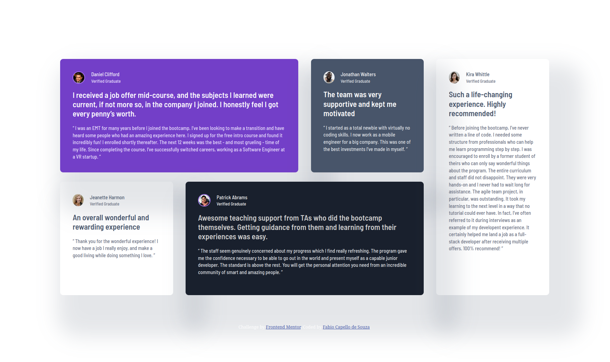

# Frontend Mentor - Testimonials grid section solution

This is a solution to the [Testimonials grid section challenge on Frontend Mentor](https://www.frontendmentor.io/challenges/testimonials-grid-section-Nnw6J7Un7). Frontend Mentor challenges help you improve your coding skills by building realistic projects. 

## Table of contents

- [Overview](#overview)
  - [The challenge](#the-challenge)
  - [Screenshot](#screenshot)
  - [Links](#links)
- [My process](#my-process)
  - [Built with](#built-with)
  - [What I learned](#what-i-learned)
  - [Continued development](#continued-development)
  - [Useful resources](#useful-resources)
  - [AI Collaboration](#ai-collaboration)
- [Author](#author)
- [Acknowledgments](#acknowledgments)

## Overview

### The challenge

Users should be able to:

- View the optimal layout for the site depending on their device's screen size

### Screenshot



### Links

- Solution URL: [GitHub](https://github.com/capellofabio/fem-testimonials-grid-section/)
- Live Site URL: [GitHub Pages](https://capellofabio.github.io/fem-testimonials-grid-section/)

## My process

### Built with

- Semantic HTML5 markup
- CSS custom properties
- SASS 7-1 inspired architecture
- Flexbox
- CSS Grid
- Mobile-first workflow

### What I learned

I've improved on my CSS Grid skills, learned how a component-based approach works and how to work with a downloaded font instead of relying on the Google Fonts API. Lastly, I learned how data-* works and how to target them.

```html
<div class="card" data-bg="purple-500" data-user="daniel-clifford">
```
```css
[data-user="kira-whittle"] {
    grid-column: 4;
    grid-row: 1 / span 2;
}
@font-face {
    font-family: 'Barlow Semi Condensed';
    src: url(../../typography/BarlowSemiCondensed-SemiBold.ttf) format('truetype');
    font-weight: 600;
    font-style: normal;
}
```

### Continued development

I want to continue working on improving my understanding of component-based approach and I'll be looking into using SASS and JavaScript on my next projects.

### Useful resources

- [Sajid Youtube Video](https://www.youtube.com/watch?v=-uyI0TjhXdk) - This helped me learn component-based approach.
- [MATBMS approach on a FEM project](github.com/MATBMS/four-card-feature/) - I've taken a HUGE inspiration on MATBMS's Four Card Feature project solution, specifically his 7-1 based architecture.

### AI Collaboration

As usual, I've used AI solely for basic stuff like searching, feedback on my code (never generating code for me) and suggestions for class names. This time, I've also used it as a learning tool to understand @font-face CSS property and git commit conventions.

## Author

- Website - [Fabio Capello de Souza](https://www.your-site.com)
- Frontend Mentor - [@capellofabio](https://www.frontendmentor.io/profile/capellofabio)

## Acknowledgments

I'd like to thank user @MATBMS (https://www.frontendmentor.io/profile/MATBMS) for his public repositories with beautiful and well-commented code.
